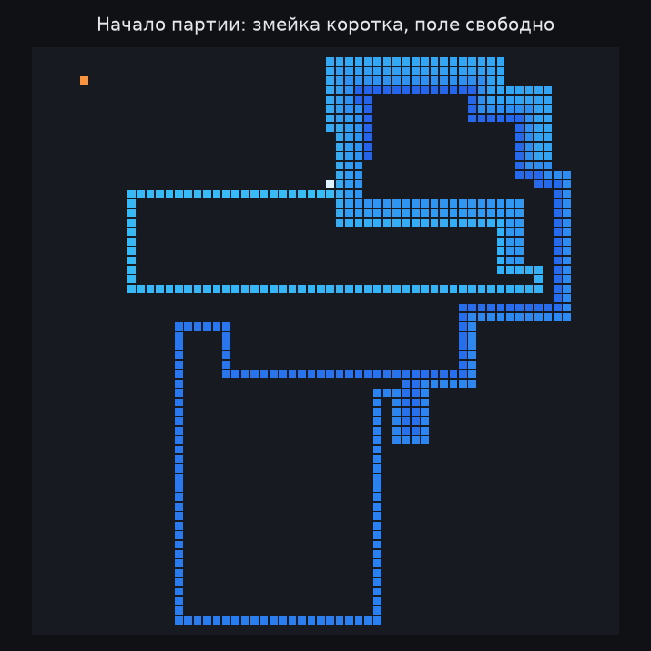
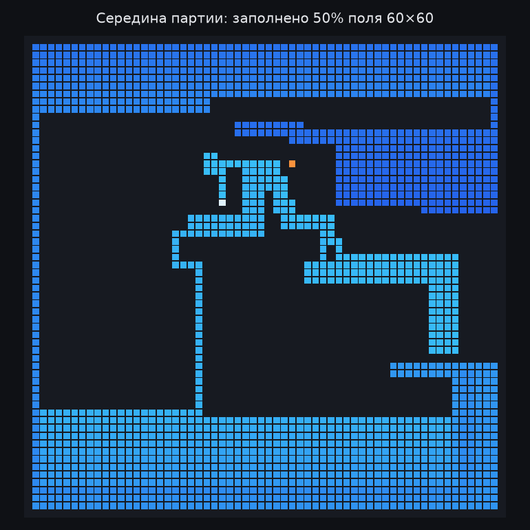
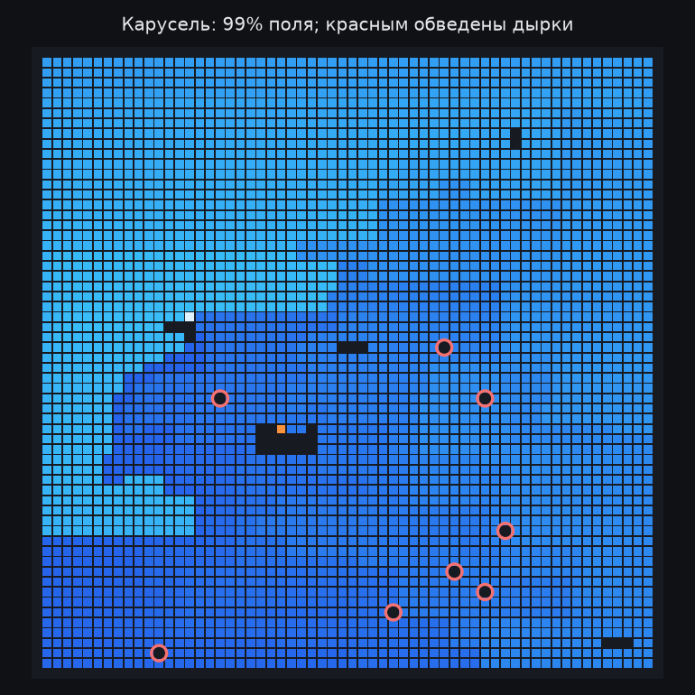
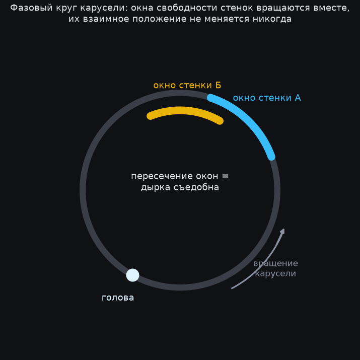
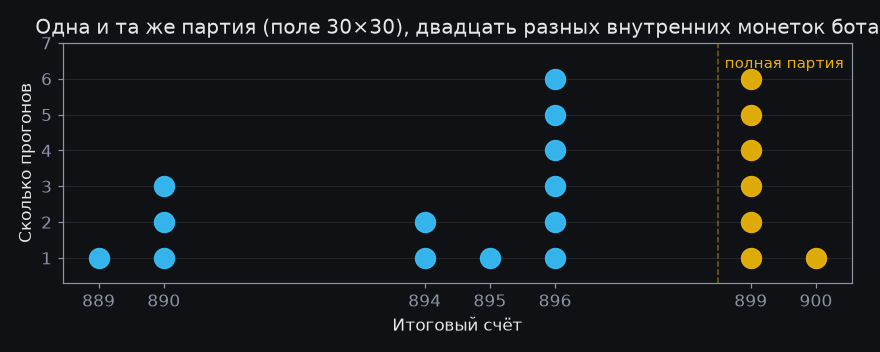
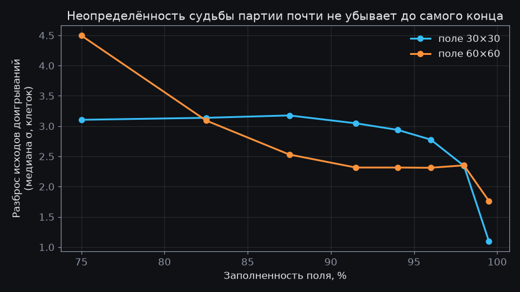
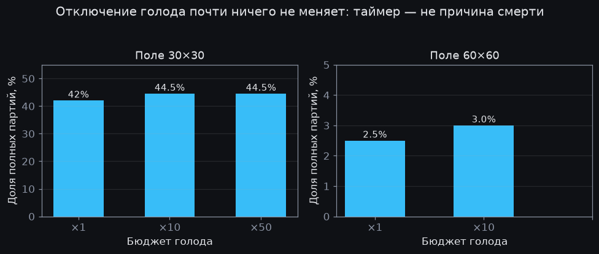
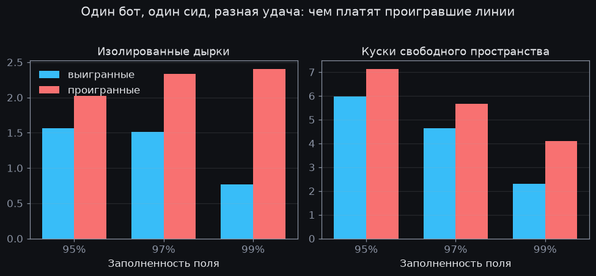
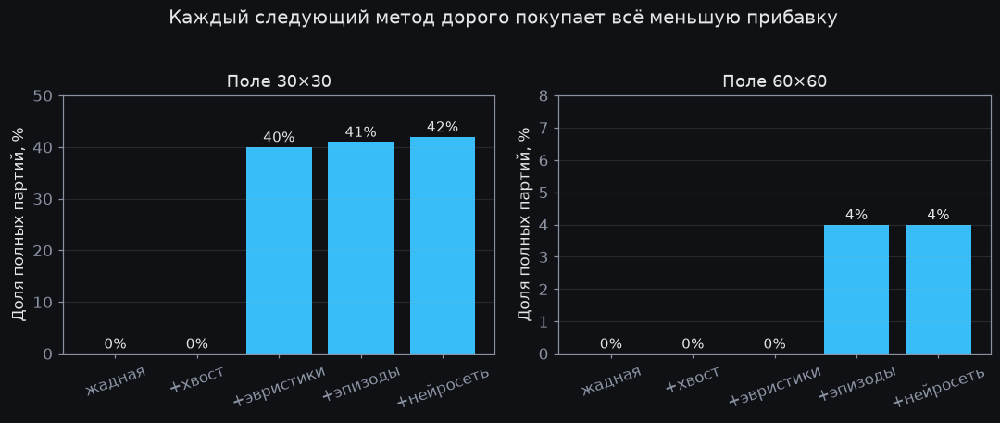

# Змейка, которая доедает поле: история одного исследования

Этот документ — история погони за целью, которая так и не была взята.

Мы учили бота играть в классическую змейку так, чтобы он стабильно съедал
поле 60×60 целиком — все 3600 клеток. Скажем сразу: стабильно не вышло.
Вышло понять и измерить, почему — и этот потолок оказался интереснее рекорда.

Написан документ по горячим следам нескольких исследовательских суток —
со всеми тупиками, опровергнутыми гипотезами и цифрами. В замерах мы
засчитываем и «минус одна клетка»: достанется ли последняя — лотерея
расположения, и плюс-минус одна ничего не решает.

Единственное запрещённое средство — гамильтонов цикл. Если проложить по полю
замкнутый маршрут через все клетки ([гамильтонов цикл](https://ru.wikipedia.org/wiki/Гамильтонов_граф))
и просто ездить по нему, змейка гарантированно съест всё — но это скучно: бот
выигрывает ещё до начала партии, а сама игра превращается в ожидание.

Почти все
известные «идеальные» боты устроены именно так, иногда со срезаниями пути
([раз](https://github.com/cheranmahalingam/snake_hamiltonian_cycle_solver),
[два](https://github.com/LPRowe/perfect-snake-challenge)). Мы запретили себе и
статический цикл, и его динамическую починку. Разрешён любой честный поиск по
текущему состоянию: BFS, симуляции, машинное обучение.

## Глоссарий

Термины, которыми пользуется весь документ. Читать подряд не обязательно —
сюда удобно возвращаться по мере чтения.

- **Такт** — один ход игры: змейка обязана сдвинуть голову на соседнюю клетку,
  стоять на месте нельзя.
- **Сид** (зерно случайности) — число, которым запускается генератор
  случайностей. Их в игре два независимых: сид партии (где появляется еда)
  и сид бота (его внутренние «монетки»); в обычных замерах они совпадают.
  Одинаковая пара сидов — одна и та же партия бит-в-бит; развести их — и
  можно смотреть, что меняет только удача или только характер бота.
- **Спавн** — появление еды на случайной свободной клетке после того, как
  съедена предыдущая. Еда на поле всегда ровно одна.
- **Дырка** — свободная клетка, со всех сторон окружённая телом змейки.
  В конце партии вся оставшаяся еда появляется только в дырках.
- **Карусель** (жёсткий цикл) — режим движения в конце партии: змейка едет
  вплотную за собственным хвостом по фиксированному замкнутому маршруту.
- **Расписание освобождений** — для каждой клетки маршрута известно, через
  сколько тактов хвост её освободит и сколько тактов она пробудет свободной.
  Вся наука эндшпиля — про это расписание.
- **Выжидание** — движение длинным маршрутом к собственному хвосту, чтобы
  потянуть время, когда безопасного пути к еде нет.
- **Доигрывание** — симуляция: из текущего состояния партию доигрывает до
  конца копия бота. Средний счёт многих доигрываний — оценка состояния.
- **Эпизод** — отрезок партии от появления еды до её съедения. Между этими
  событиями в игре нет ни одной случайности — эпизод воспроизводится точно.
- **Кандидат** — один из вариантов пути к еде, которые бот строит и
  проверяет на безопасность, прежде чем выбрать ход.
- **Фрагментация** — на сколько связных кусков разорвано свободное
  пространство поля. Один кусок — хорошо, много мелких — предвестник смерти.
- **Эндшпиль** — финальная фаза партии (по аналогии с шахматами), у нас —
  последние проценты свободных клеток.
- **Политика** — правило выбора хода: всё, что по состоянию поля решает,
  куда шагнуть. Бот целиком — это политика; «сменить политику» = сменить бота.
- **Дистилляция** — обучение лёгкой модели воспроизводить ответы тяжёлого
  метода: дорогой поиск размечает данные, дешёвая сеть учится отвечать так же.
- **Контрфакт** — «что было бы, если»: вторая версия той же партии, в которой
  изменили ровно одно обстоятельство и посмотрели на исход.
- **Полная партия** — счёт «площадь минус одна клетка» или лучше; основная
  метрика всюду — доля полных партий.
- **Гамильтонов цикл** — замкнутый маршрут через каждую клетку поля ровно
  по одному разу; запрещённое в этом проекте читерство.

Документ разбит на четыре части: **игра и наука эндшпиля** (правила, лёгкие
ступени и главные открытия о финале), **машинерия** (поиск, нейросеть и почему они устроены
именно так), **опровержения** (серия экспериментов, закрывших по очереди
все надежды) и **ответ** (почему потолок именно там, где он есть).

# Часть I. Игра и наука эндшпиля

## Правила и метрика

Движок написан с нуля (Kotlin), детерминированный: один сид — одна и та же игра
бит-в-бит. От партии к партии меняется всё случайное — последовательность мест
появления еды и внутренние монетки бота; оба потока случайности разворачиваются
из сида, поэтому новый сид даёт полностью новую партию, а повтор сида
воспроизводит старую в точности.

Поле W×H без внутренних стен; еда появляется в случайной свободной
клетке, всегда ровно одна. Съел последнюю свободную клетку — победа.
Смертей три: врезаться в стену, врезаться в собственное тело — и умереть
от голода.

Голод — полноценное правило игры:
если змейка не ела дольше, чем двукратная площадь поля тактов (1800 на 30×30,
7200 на 60×60), партия заканчивается. Без этого правила игра вырождается:
бот мог бы бесконечно кружить за собственным хвостом, ничем не рискуя, и
любой замер терял бы смысл.

Дальше это правило ещё сыграет свою роль — и как самая частая причина
смертей на большом поле, и как подозреваемый, которого пришлось оправдать
отдельным экспериментом.

Метрика всюду ниже — **доля полных партий**: в скольких играх поле съедено
фактически целиком, не хуже «площадь минус одна клетка». Редчайший случай,
когда съедены все клетки без остатка, будем отдельно звать выигрышем всухую.

Все сравнения
стратегий гоняются на общих наборах сидов, чтобы разница не тонула в удаче;
серии по 200–400 партий дают точность в единицы процентных пунктов, поэтому
«не сдвинулось» всюду ниже значит «в пределах этой точности», а решающие
замеры делались с заранее объявленным порогом успеха.

## Первые ступени

### Жадная стратегия



Первый бот делал очевидное: кратчайший путь к еде (BFS), а если пути нет —
ход в сторону наибольшего свободного пространства. Результат на 30×30 —
в среднем **150 клеток из 900**. Змейка растёт, начинает мешать сама себе
и довольно быстро зажимает собственную голову.

### Не терять хвост

Классическая идея, встречающаяся в большинстве не-гамильтоновых ботов
(например, в [обзоре эвристик](https://hogg.io/projects/snake) или
[SnakeSolver](https://github.com/DC-Data/SnakeSolver)): ход к еде можно делать
только если *после виртуального съедения* голова всё ещё может дойти до
собственного хвоста.

Хвост — это гарантия от столкновений: пока он достижим, можно ехать за
ним и ждать лучших времён (голодный таймер, правда, продолжает тикать). Если безопасного пути к еде
нет — выжидаем: тянем время, следуя длинным маршрутом к собственному хвосту.

```kotlin
val post = bodyAfterEating(body, pathToFood)   // виртуально съели
if (!reachable(post.head, post.tail)) {        // хвост стал недостижим?
    return stallTowardsTail()                  // путь отвергнут: выжидаем
}
```

Скачок огромный: 30×30 — в среднем **893 из 900**, 60×60 — **3575 из
3600** (вся дальнейшая наука поднимет медиану большого поля до 3591 — и на
этом застрянет). Но полных побед на больших полях ноль, и дальше начинается
настоящая история: последние два-четыре десятка клеток не даются никак.

## Наука эндшпиля



Мы построили инструменты вскрытия: дампы досок в момент смерти, покадровые
записи последних ходов, счётчики решений бота. Почти всё важное ниже найдено разглядыванием этих вскрытий, а не выведено
из общих соображений.

### Карусель

Когда змейка занимает ~99% поля, она движется следом за собственным
хвостом по фиксированному замкнутому маршруту — жёсткому циклу, по которому
тело вращается, как карусель. Маршрут длиннее тела ровно на число свободных
клеток поля: освободившаяся клетка пустует эти несколько тактов и снова
занимается головой. Чем меньше свободных клеток, тем плотнее карусель — в
пределе голова идёт вплотную за хвостом.

Свободными остаются считанные клетки — не один общий очаг свободного места,
а одиночные дырки, разбросанные по телу карусели. Еда появляется только
в них, потому что больше негде.



Стенки дырки — клетки тела, примыкающие к ней с четырёх сторон. Съесть
дырку можно единственным способом: подъехать к одной из стенок ровно в тот
такт, когда хвост её освобождает, нырнуть внутрь — и чтобы через такт-другой
освободилась другая стенка, через которую голова выйдет наружу.

Всё решает расписание: каждая клетка
тела освобождается в известный момент (её позиция от хвоста), а свободной
остаётся ровно `gap` тактов — по числу пустых клеток поля, на которые
маршрут длиннее тела.

У дырки есть «окно съедобности», только если интервалы свободности двух её
стенок пересекаются. В коде это условие занимает несколько строк (`gap` —
число свободных клеток поля: ровно столько тактов освободившаяся клетка
пустует, прежде чем голова займёт её вновь; `slack` — страховочный запас
в пару тактов):

```kotlin
// b[i] — через сколько тактов освободится i-я стенка дырки, L — длина тела.
// Проверка одной пары стенок (i, j); полный вариант перебирает все пары:
val forward = (b[i] - b[j]).mod(L)
val digestible = gap - forward >= slack || gap - (L - forward) >= slack
```

### Теорема о бесполезности ожидания

Всё в этом разделе относится к жёсткой карусели: маршрут зафиксирован,
змейка обязана двигаться по нему каждый такт. Пока маршрут перестраивается
(при поеданиях), рассуждение не действует — на том и строится вся защита.



Схема выше — фазовый круг карусели: два окна свободности вращаются вместе
с маршрутом, и их взаимное расположение — константа.

Первая надежда была:
подождём нужной фазы. Мы даже построили точный перебор
всех фаз ожидания (в замкнутой петле «подождать N тактов» — это просто
повернуть расписание на N). Перебор оказался почти бесполезен, и причина
простая: голова движется вместе с расписанием — за один оборот маршрута
все фазы сдвигаются на одну и ту же величину, поэтому *относительные* фазы
стенок дырки не меняются никогда. Если окно
не пересекается сейчас, оно не пересечётся ни через круг, ни через сто кругов.

На карусели не подождёшь: жёсткий цикл с рассинхронизированной дыркой
проигран навсегда, и единственная защита — не создавать таких дырок,
пока поле ещё пластично.

### Что оказалось вредным

Дальше мы гоняли идеи турнирами: десятки конфигураций, сотни игр на каждую, общие сиды. Список
опровергнутого впечатляет больше списка подтверждённого:

- **Поиск «по расписанию» как проверка безопасности.** Поиск, в котором клетки
  тела считаются проходимыми, если к моменту прихода они освободятся, отлично
  строит конкретные маршруты. Но как проверка выживаемости он лжёт: «приди к
  клетке не раньше такого-то такта» на деле означает «подожди», а ждать в игре
  нельзя — голова обязана ходить каждый такт, и лишние ходы сами меняют
  расписание.
- **Жёсткие запреты на создание дырок.** Полный запрет душит бота голодом:
  отказавшись есть, он умирает от таймера. Работает только мягкая версия —
  «не увеличивай число несъедобных дырок».
- **Жёсткое следование выжидательным маршрутам, обход клеток вокруг еды, десяток других
  правдоподобных эвристик** — всё измеримо хуже простого хаотичного выжидания
  с перепланированием каждый такт.
- **Случайные укусы.** Отдельная легенда, найденная вскрытием: аварийные
  ходы последнего шанса (когда ни один проверенный план невозможен, бот
  делает любой не убивающий сразу шаг) иногда наступали на еду «мимо кассы»,
  в обход всех проверок безопасности — и бот погибал через такт после незапланированного
  обеда. Всё, что не принятый план, теперь не имеет права трогать еду.

Лучшую чисто эвристическую конфигурацию мы дальше зовём чемпионом —
с ней сравниваются все последующие эксперименты. Она вышла на **~55% полных партий на игрушечном поле 15×15, ~40% на
30×30 и медиану 3591 на 60×60 — но ни одной фактически полной игры на большом поле**.

### Кризис выбора

Самый неприятный результат этой серии.

Мы построили несколько всё более умных
механизмов выбора *какой именно путь к еде взять*: ранжирование по будущей
фрагментации поля, выбор худшего случая по клеткам следующего появления еды, наконец —
оценку кандидатов настоящими доигрываниями движка, без каких-либо упрощений. Ни один способ не дал ничего.

Итоговое объяснение собрано из замеров: к моменту, когда остаётся ~16 свободных
клеток, результат партии уже определён общим для всех кандидатов «старым» телом;
а решения, которые её определили, размазаны по десяткам поеданий на заполнении
95–99%.

(Забегая вперёд: «кривая решённости» ниже уточнит это наблюдение —
результат определяется не в середине партии, а именно в этой поздней зоне; но
в момент выбора очередного пути к еде менять её уже поздно.)

Одношаговые
критерии эту связь не видят в принципе — классическая проблема длинного
горизонта.

# Часть II. Машинерия

## Дисперсия внутри бота



Ключевой эксперимент, который развернул всё исследование, стоил считаных строк
кода: зафиксировать сид игры на поле 30×30 и прогнать её двадцать раз с разными сидами
*генератора случайностей самого бота* (его выжидание подкидывает монетку при
выборе формы маршрута).

Результат: на одном и том же поле бот набирает **от
885 до 900**. От сида к сиду меняется всё. От 7 до 13 прогонов из 20 достигают
цели.

То есть внутри уже написанного бота живёт огромная дисперсия, и вопрос
не «как играть лучше», а «как систематически выбирать свои же удачные ветки».

## Эпизодный поиск

Движок детерминирован, а между появлением еды и её съедением не происходит
ни одного случайного события. Значит, эпизод «от спавна до еды» можно прожить
заранее: клонируем состояние, проигрываем несколько вариантов со своими
разными монетками, у каждого оцениваем последствия доигрыванием до конца
партии — и исполняем лучший вариант в реальной игре.

Скелет метода (k вариантов эпизода, m доигрываний на каждый) умещается в десяток строк:

```kotlin
// При каждом появлении еды в эндшпиле:
val sharedSeeds = LongArray(m) { rng.nextLong() }   // общий шум для всех вариантов
val best = (1..k).map {
    val myLuck = rng.nextLong()
    val episode = simulateUntilEaten(state, policy(myLuck))   // policy(x) — копия бота
                                                              // с монетками x; точный повтор до еды
    val value = sharedSeeds.map { s -> playToEnd(episode.endState, s).score }.average()
    episode to value
}.maxBy { it.second }
commit(best.first.moves)   // исполняем лучший эпизод ход в ход
```

Одна тонкость решила всё: доигрывания шумят (будущая еда падает случайно),
и сравнивать варианты можно только на **общих случайных числах** — одинаковых
сидах будущих спавнов у всех вариантов (`sharedSeeds` выше). Парное сравнение
вычитает общий шум.

Это дало первые в проекте фактически полные игры на 60×60 —
и урок: усиление поиска (больше вариантов, больше доигрываний) упирается
в насыщение почти сразу. Сигнал между вариантами — полклетки, шум
доигрывания — пять клеток.

## Нейросеть

Доигрывания дороги: они умножают стоимость игры в десятки раз. Требование
к финальному решению было противоположным: тяжёлым имеет право быть
обучение, но не сама игра.

Это ровно схема AlphaZero, применённая в миниатюре: дорогой поиск
работает учителем на этапе обучения, а в бою играет дистиллированная сеть
([Silver et al., 2017](https://arxiv.org/abs/1712.01815); сам приём «поиск
учит сеть, сеть усиливает поиск» описан как
[Expert Iteration](https://arxiv.org/abs/1705.08439)).

Первый заход был честно провальным.

Линейная регрессия на дюжине рукодельных
признаков формы петли научилась отличать хорошие состояния от плохих (AUC 0.75: метрика ранжирования —
в трёх случаях из четырёх правильно упорядочивает случайную пару «хорошее/плохое»),
но в игре не дала ничего: она оценивает состояние целиком, а варианты хода
в один и тот же момент почти не отличаются её признаками — выбирать ей
оказалось не из чего.

Второй заход — сырые данные вместо признаков.

Вход сети — четыре плоскости
размером с поле: карта расписания освобождений (то самое, чем решается
съедобность дырок), маска свободных клеток, позиция головы, уровень заполнения.

Свёрточная сеть на ~сто тысяч параметров (сотни килобайт весов) получает
эту картинку на вход и выдаёт одно число — сколько клеток, по её мнению,
бот недоберёт до полного поля из этого состояния. Обучение — предсказывать
этим числом средний результат многих доигрываний.

Метки собираются
конвейером самоигры: тысячи партий, каждое эндшпильное состояние размечается
32 честными доигрываниями движка.

### Почему именно такая сеть

Выбор архитектуры не был вкусовым.

Оценивать нужно форму петли, а её
паттерны локальны и могут встретиться в любом месте поля — это ровно то,
для чего создана свёртка с её нечувствительностью к сдвигам. Сеть при этом
полностью свёрточная: в ней нет ни одного слоя, привязанного к размеру
входа, поэтому обученная на 30×30 модель без изменений принимает поле
60×60 — перенос между размерами достаётся бесплатно, конструктивно.

Против более тяжёлых архитектур говорили данные: десятки и сотни тысяч
примеров — масштаб, на котором маленькая свёрточная сеть уже сыта, а
большие модели начинают запоминать вместо обобщения. Против более лёгких —
измерение: линейная модель на рукодельных признаках уже провалилась.

Входные признаки выбраны теорией, а не перебором.

Карта расписания
освобождений — это в точности та информация, из которой вычисляется
съедобность дырок, главный доменный сигнал; остальные три плоскости —
дешёвый контекст. Метка нормируется удвоенной стороной поля (см. листинг), чтобы один
масштаб ошибки годился всем размерам; из всех эпох обучения сохраняется та, что
лучшая по отложенной выборке, а не последняя:

```python
# cells — клетки тела от головы к хвосту; head_onehot — единица в клетке головы;
# fill — константная плоскость «насколько заполнено поле»
body[cells] = (length - arange(length)) / length  # расписание освобождений
planes = [body, body == 0, head_onehot, fill]     # 4 плоскости H×W
label  = (area - mean_score) / (2 * side)         # дефицит / удвоенная сторона
```

Ширина и глубина подобраны короткой сеткой замеров по валидации: 48 каналов
на 5 блоков оказалось достаточно, и позже это проверили жёстко — сеть в
десять раз больше не изменила в игре ничего (глава «Проверка ёмкостью»).

Результат первой же сети (20 тысяч примеров): предсказание дефицита — недобора
клеток до полного поля — с ошибкой
**0.99 клетки** против 1.97 у тривиального предсказателя, корреляция 0.87.
В игре — тот же результат, что у поиска с доигрываниями, при **втрое**
меньшей стоимости хода (замер на 30×30; на большом поле экономия двукратная —
там и сам ход без доигрываний дороже).

В запуске остаются два файла — программа и веса модели: обучение живёт в
[PyTorch](https://pytorch.org), в бой сеть едет через
[ONNX](https://onnx.ai) и [ONNX Runtime](https://onnxruntime.ai) — пара
небольших файлов модели и одна JVM-зависимость; во время игры питон не нужен вовсе.

Приятный сюрприз: сеть, обученная только на 30×30, играет на 60×60 **на уровне
поиска с доигрываниями** — перенос между размерами поля работает без единого
примера целевого размера (сеть полностью свёрточная, ей всё равно, какого
размера вход).

### Потолок учителя

Естественная следующая ставка — «больше данных».

Датасет нарастили с 20 до 181 тысячи примеров (облачная машина размечала их со скоростью ~1090
доигрываний в секунду против ~320 у ноутбука). Ставка не сыграла: метрики
валидации остались на месте (ошибка ~1 клетка), а игровые результаты — в
пределах шума, даже чуть ниже первой сети.

Вывод из этого отрицательного результата важнее самого результата.

Сеть
обучается предсказывать исход доигрываний конкретной политики — и делает это
уже почти идеально: остаточная ошибка в ~1 клетку — это в основном
неустранимая случайность будущих спавнов, а не незнание. Дистилляция не может
превзойти учителя; она лишь удешевляет его. Больше данных того же сорта учат
сеть точнее воспроизводить тот же потолок.

Дальше — классический цикл экспертной итерации: собрать данные политикой,
которая уже играет с сетью (и потому дешевле думает), с более сильным
поиском на стороне учителя — и обучить следующую сеть уже на них. В теории
каждый виток поднимает и учителя, и ученика. Как выяснится ниже, этот цикл мы прошли до конца — и очередной виток
упёрся в тот же потолок.

## Инфраструктура

Разметка доигрываниями — чистый CPU и идеальный параллелизм, поэтому под неё
арендуется прерываемая облачная машина на девять десятков ядер, ~30–40 ₽/час (прерываемые
инстансы в несколько раз дешевле обычных — платой за риск внезапной
остановки). Она размечает ~1090 доигрываний в секунду против ~320 у ноутбука.

Против сбоев —
три уровня: сборщик пишет данные небольшими порциями и умеет продолжать с места обрыва; cron на
самой машине перезапускает работу после вытеснения или ребута; cron на ноутбуке
поднимает остановленную машину и зеркалит данные к себе.

Бюджет-предохранитель
на счёте не даёт экспериментам съесть больше 10 тысяч рублей в месяц.

## Логика конструкции

Оглядываясь назад, легко принять эту архитектуру за замысел. На самом
деле каждый её элемент был вынужденным: очередное измерение закрывало целый
класс решений, и оставался один выход. История на этом не закончилась —
дальше документ ещё не раз выйдет за пределы этой конструкции, — но каждый
следующий шаг отталкивался от неё.

**Шаг 1. Запрет цикла → бот обязан думать в процессе игры.** Без заранее
проложенного маршрута всё решается онлайн-поиском по текущему состоянию.
Это выбор условий задачи, а не наш.

**Шаг 2. Наука эндшпиля закрыла локальные эвристики.** Карусель
показала: исход определяется не последним ходом и даже не последним десятком
ходов, а формой, в которую тело сложилось за десятки поеданий до того. Любое
правило вида «посмотри на доску и выбери ход получше» упирается в потолок,
потому что нужной информации в текущем ходе просто нет.

Мы упёрлись
в этот потолок несколькими независимыми способами — ранжированием кандидатов,
перебором худших случаев появления еды, выбором пути по доигрываниям — и все
они дали ноль. Значит,
оценивать надо не ходы, а далёкие последствия целых траекторий.

**Шаг 3. Эксперимент с дисперсией указал, где именно искать.** Разброс
885–900 на фиксированном поле означал две вещи сразу: (а) в уже написанном
боте существуют траектории, доедающие поле — их не надо изобретать, их надо
находить; (б) искать нужно на уровне вариантов собственного поведения, а не
вариантов одного хода.

Отсюда эпизодный поиск: прожить несколько версий
ближайшего будущего в симуляции и исполнить лучшую. Детерминизм движка
превратил эту идею из приближения в точный метод — эпизод до еды
воспроизводится ход в ход.

**Шаг 4. Требование дешёвой игры превратило поиск в учителя.** Эпизодный
поиск работает, но платит десятками доигрываний за каждое решение — в живой
игре так жить нельзя. Классический выход известен по AlphaZero: тяжёлый поиск
генерирует обучающий сигнал, лёгкая сеть его впитывает, и в бою остаётся
только она.

Наш случай даже проще шахмат: оценивать нужно не произвольную
позицию, а форму почти сложившейся петли, и главная нужная информация — карта
расписания освобождений — подаётся сети прямо на вход. Поэтому
крошечная свёрточная сеть сравнялась с доигрываниями уже после первого же
датасета — и бесплатно перенеслась на другой размер поля.

Итоговое разделение труда выглядит закономерным: инварианты выживания
(достижимость хвоста, съедобность дырок) остались дешёвым точным скелетом,
не требующим обучения, а суждение о далёких последствиях, для которого
правил не существует, отдано сети, обученной на доигрываниях.

# Часть III. Опровержения

## Массовая проверка гипотез

Шесть гипотез — от «результат партии определяется в середине игры» до сверхточных парных
оценок — прошли проверку сериями по 200–400 игр каждая. Почти все не
подтвердились, что само по себе результат. Три главных итога:



- **Кривая решённости** (12 тысяч состояний, размеченных 32 доигрываниями каждое):
  неопределённость исхода постоянна от 70% до 93% заполнения, слегка снижается
  к 97% и схлопывается только на 97–99%. Гипотеза «результат определяется в середине игры» опровергнута
  измерением: игра остаётся открытой почти до самого конца.
- Из фазовой модели карусели (той самой, что дала теорему о бесполезности
  ожидания) выведен «бюджет ремонта» — строгая граница того,
  сколько рассинхронизированных дыр ещё можно починить. Проверка на данных: при
  средних плотностях инвариант не активируется вовсе; зато **число изолированных
  дыр** предсказывает результат партии с AUC 0.85. Увы, предсказатель не стал управляющей переменной:
  ранжирование ходов по числу дыр игру не улучшило — дыры возникают из
  ограничений позиции, а не из выбора пути.
- Масштабирование эпизодного поиска (16 и 32 варианта вместо 4, сверхточные
  парные оценки в решающей зоне) — ничего не сдвинулось. Вывод глубже отдельных неудач:
  разброс 885-900 — это не «существуют хорошие ветки, которые надо выбрать»,
  а сумма сотен микроскопических случайных отклонений, ни одно из которых не
  видно по отдельности. Хвост распределения не отбирается — среднее нужно
  смещать, меняя сам генератор траекторий.

## Чистые метки

Синтез этой серии проверок оставил два пути: менять генератор траекторий
или строить более точный оценщик.
 Первый закрылся быстро: жёсткие ленточные маршруты и
следование заранее выбранной форме стабильно проигрывали хаотичному
перепланированию (подробности — в лабораторном журнале).

Второй получил
полноценную проверку — разметка точным шагом (в литературе метод известен
как fitted value iteration).

Идея: раз доигрывания шумят (разброс 3-5 клеток),
не будем доигрывать.

Новую метку состояния строим одним точным шагом:
перебираем все возможные места появления еды, для каждого — лучший
безопасный путь к ней, а ценность того, что получится после съедения,
спрашиваем у уже обученной сети. Среднее по местам появления — метка.
Единственный источник ошибки — сама сеть в конце этой короткой цепочки;
случайность будущего усреднена явно, а не оценена случайной выборкой.

Семьдесят две тысячи таких меток на обоих размерах; вместе со старыми
корпусами обоих полей и свежими состояниями середины игры — объединённый
корпус на 350 тысяч, на нём обучена новая сеть.

Результат: на 30×30 — вровень со всеми
предшественниками, на 60×60 решающий замер в 200 игр — 4 полных партии (2.0%) против
7 из 300 у закреплённой базы (2.3%).

Порог прорыва — правило проекта: перед каждым решающим замером мы заранее
фиксируем, какую цифру сочтём успехом, чтобы не подгонять трактовку под
результат, — был объявлен на уровне 6% и не достигнут. Ветка закрыта —
ещё одна в длинном списке.

Одна деталь всё же примечательная: в этой серии случился первый полностью
выигранный всухую матч на 60×60 — все 3600 клеток, строго больше зачётной
планки «минус одна», и без гамильтонова цикла.

Трактуем
скромно: это хвост распределения, одна игра из двухсот на одном сиде, и удачная
последовательность появлений еды могла сделать ровно эту партию выигрываемой.
Существование выигрыша в общем случае этим не доказано — но как минимум показано,
что текущая политика физически способна довести партию до последней клетки.

Попутно кривая решённости переснята на большом поле (3200 состояний):
неопределённость исхода тает плавно и не схлопывается до последнего
процента клеток — та же картина, что на малом поле, растянутая ещё дальше
к самому концу.

А чистые метки объяснили,
почему это не помогло: сигнал одного решения (~полклетки) всё ещё тоньше
разрешающей способности сети, а точный шаг разметки не убирает её же
ошибку в конце цепочки.

## Проверка ёмкостью

Оставался последний аргумент в защиту оценщиков: может быть, сеть просто
мала? Сигнал одного решения — полклетки, ошибка сети — клетка; вдруг дело
в разрешающей способности?

Обучение к этому моменту переехало с ноутбука в облако: арендованная машина
с видеокартой прогоняет полный проход по корпусу — а он вырос до полумиллиона
состояний за счёт свежих данных, собранных уже политикой с сетью, — за шесть
минут вместо двадцати пяти.

На ней обучили сеть в десять раз больше прежней.
Она показала лучшую точность за историю проекта: ошибка предсказания на
большом поле — 1.75 клетки против 2.44 у предшественницы (числа малого поля
из ранних глав с этими напрямую не сравнимы — там и задача, и разброс другие).

Игровой результат: средний счёт совпал с прежней сетью **до второго знака
после запятой** — 3589.29 у обеих. Не «примерно столько же» — та же самая
цифра; третий замер (чемпион с доигрываниями на тех же сидах) дал 3589.28.

Этот результат закрыл оценочную сторону целиком:
доигрывания, девять версий сети — от первой линейной до десятикратной, —
чистые точные метки — всё упирается в одну и ту же цифру. Узкое место — не то, насколько точно
мы видим будущее, а то, что в момент выбора выбирать не из чего.

## Гипотеза сортировки

Свежая идея со стороны: затыкание дыр — это подвид задачи сортировки.
Собрать все дырки «с одной стороны» поля, и эндшпиль решится сам; змейка —
сортировочная машина с очень дорогой операцией перемещения.

Гипотезу проверили с нескольких сторон, и вскрытие оказалось поучительнее
вердикта.

Ранжирование путей к еде по фрагментации свободного
пространства дало партии, **бит-в-бит совпавшие с чемпионскими** — не
похожие, а идентичные до последнего хода: в середине игры свободное
пространство почти всегда одна компонента, метрика вырождена, сортировать
буквально нечего.

Выбор формы выжидательных кругов по той же метрике — минус одиннадцать
процентных пунктов доли полных партий (62 полных партии из 200 против 84
у чемпиона, поле 30×30): во время выжидания дыры не рождаются, там нечем
управлять.
А в глубоком эндшпиле дыры уже неподвижны — фазовая инвариантность карусели.

Сама же метрика при этом оказалась лучшим известным предиктором результата:
ранговая корреляция с итогом партии 0.49 против 0.41 у числа дыр на тех же
метках. Гипотеза
верна как диагноз и пуста как рычаг: «неотсортированность» поля реальна,
измерима и складывается там, куда одношаговым решениям не дотянуться.

## Точный решатель эндшпиля

Если наверху (обучение) и в середине (эвристики) рычага нет, оставался низ.

В зоне последних 6-14 клеток игра достаточно мала, чтобы её не
оценивать, а **решать** — полный перебор по всем будущим появлениям еды
(усреднение: спавны случайны) и по путям поедания (максимум: путь выбираем
мы), рекурсией до победы или смерти, с мемоизацией и строгой дисциплиной:
бот принимает только сертифицированные линии, где каждая ветвь будущего
доказанно доигрывается до цели.

```kotlin
// псевдокод; базовые случаи: поле съедено -> 1.0, ходов нет -> 0.0
fun value(state): Double = memo(state) {
    if (state.isFull) return 1.0
    val walks = candidates(state)                // безопасные пути к еде
    if (walks.isEmpty) return 0.0                // выжидание не спасёт: голод
    walks.maxOf { walk ->                        // путь выбираем мы
        spawns(after(state, walk)).map { food -> // еду выбирает случай
            value(after(state, walk, food))
        }.average()
    }
}
// бот исполняет только сертифицированные линии: value == 1.0 достигается
// лишь когда каждый лист поддерева — точная победа, без плавающего шума
```

Решатель работает — за прогон он выдаёт полторы сотни сертификатов побед.
Результат (поле 30×30): во всех трёх замерах — с зоной в 6, 10 и 14
клеток — ровно 84 полных партии из 200, клетка в клетку с базой без
решателя. Каждая сертифицированная концовка и так выигрывалась хаосом.

Самое информативное опровержение всей серии: в зоне, где точное решение
вычислимо, и в проверенном классе линий сертификация не нашла ничего сверх
того, что хаотичное перепланирование берёт само.
Это идеально сходится с кривой решённости: к моменту входа в решаемую
зону результат партии уже определён.

## Отключение голода



Осталась одна подозреваемая — сами правила. У чемпиона на 60×60 из двухсот
партий около ста пятидесяти заканчиваются голодной смертью (остальные —
столкновением с собственным телом); может, таймер и есть искусственный
потолок?

Замер на обоих полях с бюджетом, увеличенным в десять и в пятьдесят раз
(штатный лимит — двукратная площадь поля: 1800 тактов на малом, 7200 на большом).

Медиана не сдвинулась ни на клетку нигде. Полных партий на малом поле стало
больше на пять из двухсот (84 → 89), на большом — на одну (5 → 6 из 200,
контрольная серия на тех же сидах); насыщение
наступает уже на десятикратном бюджете, дальше цифры не растут.

А голодных
смертей стало даже больше: бот с бесконечным терпением вечно ждёт у окна,
которое не откроется никогда, — вместо того чтобы погибнуть, пытаясь.

Девяносто тысяч тактов ожидания на малом поле не открывают ни одного окна,
оставшегося закрытым за штатные 1800: фазовая инвариантность карусели,
выведенная раньше из фазовой модели, подтвердилась грубой силой. Голод — секундомер
у проигранной позиции, а не причина проигрыша.

# Часть IV. Ответ

## Что говорит теория

Летом 2025 года вышла первая серьёзная теоретическая работа именно об этой
игре — [«Playing Snake on a Graph»](https://arxiv.org/abs/2506.21281)
(Graafsma, Manthey, Skopalik); мы нашли её уже под конец исследования.

Её результаты отрезвляют.

Определить, выигрываема ли змейка на данном графе, NP-трудно даже для
решёточных графов — то есть таких, как наше поле. Для чётных решёток — наш 60×60 — характеризация выигрышности
объявлена открытой проблемой.

А единственный механизм выигрыша без гамильтонова цикла, предъявленный в
этой работе, — семейство почти-покрывающих циклов с дешёвыми переключениями
между ними — это, по сути, ровно та «динамическая починка цикла», которую
мы запретили себе в первый день. Вся позитивная часть этой теории живёт в
запрещённой нами семье стратегий; мы сознательно играли снаружи.

Из статьи переносятся и точные чётностные леммы эндшпиля. В их модели еду
расставляет противник, и он может добиться позиции, где голова и последняя
дырка лежат в одной доле шахматной раскраски — а клетки одного цвета не
бывают соседями, финальный ход невозможен. У нас еда случайна, поэтому
для нас это не приговор, а карта худших случаев.

Мы проверили чётность и на своих данных — как возможную управляющую
переменную. Она мертва: раскраска поля в шахматные цвета жёстко сцеплена с
расписанием освобождений (тело всегда чередует цвета), поэтому чётность
фаз у стенок дырки предопределена геометрией — выбором пути её не изменить.

## Портфель близнецов

Финальный поворот начался с простого вопроса: а насколько исход партии
вообще зависит от политики?

Три наших почти неразличимых бота — эвристика,
эпизодный поиск, сеть — сыграли по 200 партий на общих сидах (поле 30×30,
где статистика набирается быстро).

Корреляция исходов между ними оказалась
неожиданно низкой (0.24-0.49) — и это не парадокс, а следствие хаотичности:
первая же развилка в решениях меняет, какие клетки заняты, а с ними — всю
дальнейшую последовательность еды; партии расходятся целиком.

Главное же:
поодиночке каждый доводит до полного поля ~40% партий, но **хотя бы один
из трёх — 70%**.

Плато, в которое упёрлись все методы, — не потолок достижимого. Точная
формулировка: большинство стартовых сидов доигрываемы до полного поля хотя
бы одним из близнецов (это свойство старта, а не одной конкретной партии —
после первой же развилки партии расходятся целиком); невозможно лишь
угадать заранее, которым.

Смена политики действует на исход конкретной
партии как ещё одна монетка — а вся серия опровержений выше объясняет, почему
эту монетку нельзя подглядеть: никакая оценка не отличает выигрышную
линию от проигрышной, пока не поздно.

## Фея еды

Если результат не зависит от выбора политики — от чего он зависит? Для ответа построили
инструмент с обратной стороны доски: «фею еды». Зерно внутренних монеток
бота фиксируется — обе партии пары бот играет с одними и теми же своими
случайностями, — и тогда вся оставшаяся удача живёт в единственном месте:
где появляется еда.

Фея даёт честному
боту сыграть обычную партию. Если бот погиб, она перематывает: первые N
появлений еды сохраняются как были, а продолжение бросается заново, другим
зерном случайности; после каждой серии неудач N уменьшается — переиграть
приходится всё более длинный кусок концовки.

Технически каждая попытка —
полный повтор партии с нуля по сохранённому началу: движок детерминирован,
это дёшево. Бот не тронут; подкручены только кости.

```kotlin
var best = play(botSeed, script = emptyList())    // честная партия
var backOff = 1                                   // сколько последних спавнов переиграть
while (best.status != WON && replays++ < budget) {
    val prefix = best.spawnLog.dropLast(backOff)  // удачу до этого места оставляем
    val retry = play(botSeed, script = prefix)    // концовку бросаем заново
    if (retry.score > best.score) { best = retry; backOff = 1 }
    else backOff = min(backOff * 2, cap)          // упорным неудачам — глубже откат
}
```

Так впервые появились **парные контрфакты**: для одного сида — проигранная
(честная) и выигранная (фейская) партии, различающиеся только
последовательностью еды. Сорок три пары на 30×30 дали три ответа разом.



Во-первых, где определяется результат: типичной победе потребовалась перекладка
**~60 последних спавнов** — победы не делаются одним удачным броском,
нужна скоординированная удача через десятки поеданий; как выяснится ниже,
на большом поле окно ещё шире. Вот почему одношаговые рычаги были обречены —
ни один отдельный выбор не решает.

Во-вторых, через что удача действует механически: после точки расхождения
выигрышные линии стабильно несут меньше изолированных дыр (0.8 против
2.4 к финалу) и меньшую фрагментацию (2.3 компоненты против 4.1). С фиксированным ботом и общим префиксом причинность появления еды
установлена строго: **места появления еды меняют результат**, и фрагментация — главный
видимый посредник этого влияния (что она посредник единственный, мы не
доказывали).

Тот же поиск на большом поле оказался дорог: слепой переброс костей дал
лишь пять побед за девять часов работы 88 ядер — но и этих пар хватило,
чтобы увидеть ту же структуру различий, а заодно измерить ширину окна переигровки:
на 60×60 переигрывать приходится ~200 и больше последних появлений еды.

В-третьих, у удачи есть геометрия: выигрышная еда ложится ближе к точке
предыдущего поедания (6.9 клетки против 8.9 по манхэттенскому расстоянию —
сумме смещений по горизонтали и вертикали) — дружелюбные кости
кормят змейку «под руку», не гоняя голову дальними рейдами через всё поле.

## Итог

Соберём всё в одну формулировку.

В змейке без гамильтонова цикла исход
теснее всего связан с фрагментацией свободного пространства в последних
процентах заполнения: это лучший найденный предиктор результата и главный
видимый посредник влияния удачи.

Продемонстрированный способ направленно управлять этой фрагментацией есть
только у генератора еды: шестьдесят согласованных появлений еды превращают
поражение в победу. Существует ли честный способ у самого игрока — открытый
вопрос (см. «Что дальше» про покрывающий планировщик).

Среди всего, что проверили мы — одношаговые правила, оценщики любой
точности, точный перебор концовки, смена политики целиком, — направленного
рычага у игрока не нашлось: выбор хода внутри политики вырожден (кандидаты
неразличимы), а смена политики лишь бросает ещё одну монетку, не сдвигая
средний результат.

Честные несколько процентов полных партий на большом поле (и ~40% на
малом, где окно требуемой удачи короче) — это вероятность того, что
равномерные кости сами сложатся в низкофрагментированную линию.

Потолок здесь не предположен, а огорожен измерениями со всех проверенных сторон — сверху обучением,
снизу точным перебором, сбоку правилами игры, и изнутри — парными
контрфактами, объясняющими его причину. Кто захочет пробить его честно,
знает, что для этого нужно: научиться влиять на фрагментацию за десятки
поеданий до заморозки — там, где выбор пока не существует.

## Где мы сейчас



| Веха | 30×30 | 60×60 |
|---|---|---|
| Жадная стратегия | 0% (в среднем 150 из 900) | — |
| + достижимость хвоста | 0% (в среднем 893) | 0%, в среднем 3575 |
| + вся эвристическая наука | ~40%, медиана 897 | 0%, медиана 3591 |
| + эпизодный поиск (доигрывания) | ~41% | **первые полные партии: 2–3% в разных сериях** |
| + нейросеть вместо доигрываний | ~42%, втрое дешевле | тот же уровень, вдвое дешевле, без единого примера этого размера |

## Что дальше

Три направления остались открытыми — для возможного продолжения.

### Направленная фея

Слепая фея перебрасывает кости, пока не повезёт, — на большом поле, как
мы видели, это дорогой способ. Направленная будет
выбирать место появления еды по измеренному профилю удачи: ближе к голове,
с минимальной фрагментацией после съедения.

Это одновременно и инструмент,
и эксперимент: если направленный выбор начнёт выигрывать на порядок дешевле
слепого, причинная цепочка «еда → фрагментация → результат» подтвердится уже
не наблюдением, а управлением. Заодно парные корпуса для большого поля
станут дешёвыми.

### Покрывающий планировщик

Все проверенные рычаги были одношаговыми — и все упёрлись в то, что в
момент выбора выбирать не из чего. Планировщик другого рода строил бы
маршрут покрытия свободного пространства на десятки поеданий вперёд и
перестраивал его при каждом появлении еды.

Наивные версии — жёсткие ленты,
следование заранее выбранной форме — измеримо проигрывали хаотичному
перепланированию; открытый вопрос в том, существует ли гибкая версия,
которая сохраняет право перепланироваться, но удерживает фрагментацию.

### Теория чётных решёток

Характеризация выигрышности змейки на чётных решётках открыта и у
профессионалов. Наши фазовые и чётностные наблюдения — инвариантность
относительных фаз, принудительная чётность стенок — выглядят как рабочие
кирпичи для этой задачи. Любое продвижение здесь было бы математическим
результатом, ценным независимо от бота.

## Приложение

```bash
./gradlew show -Pstrategy=neural        # окно с игрой (нейросетевой бот)
./gradlew benchmark -Psize=60 -Pgames=30 -Pstrategy=neural   # замер
./gradlew probe -Psize=30 -Pstrategy=sweep -Pundig=1
#   probe — вскрытия смертей; sweep — имя чемпиона-эвристики в коде,
#   undig=1 включает счётчики несъедобных дырок
./gradlew tune                          # турнир конфигураций
```

Технические журналы исследования — в `docs/RESEARCH.md` (лабораторный дневник
с полными таблицами турниров) и `docs/RUNBOOK.md` (как поднять конвейер после
любого сбоя).
